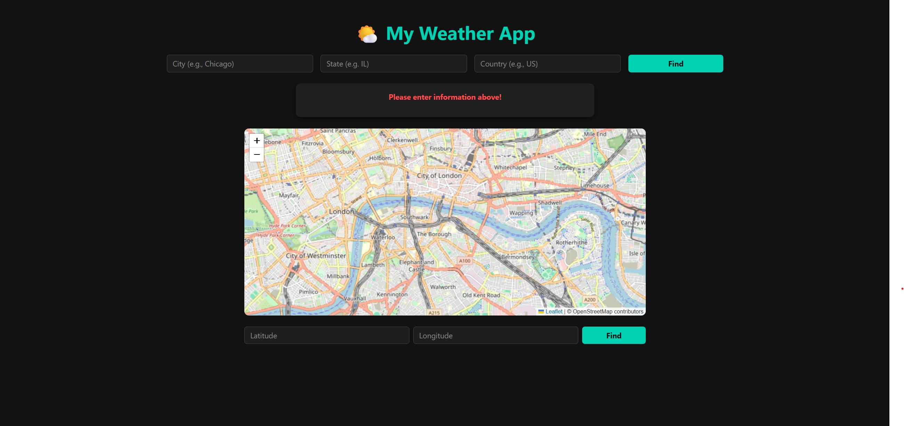

# 🌤️ Weather App

A sleek, black-themed weather application that fetches real-time weather data using the OpenWeatherMap API. The app allows users to search for weather by **city, state, and country**, or interactively select a location on a **Leaflet.js-powered map**.  

The backend is built with Flask, with a modular Python structure for maintainability, and Bootstrap provides a responsive UI design.  

---

## 📸 Screenshots

### 🏠 Blank Homepage
The clean initial landing page, prompting users to enter location details or interact with the map.  


---

### 📝 Location Information Entered (Before Search)
The user has filled in city, state, and country fields but has not yet submitted the form.  


---

### 🌦️ Weather Results After Search
Displays real-time weather data (temperature, description, and icon) for the entered location.  


---

### 🗺️ Map with Pin Dropped (Before Search)
The user has placed a marker on the interactive map but has not yet submitted the coordinates.  


---

### 🌦️ Weather Results for Map Location
Shows weather data fetched for the coordinates where the pin was dropped on the map.  


---

## 🛠 Project Structure

## 🛠 Project Structure

```
Weather-App-project/
│
├── src/ # Python source code
│ ├── app.py # Flask app entry point
│ └── weather.py # API integration and logic
│
├── templates/ # HTML templates (Jinja2)
│ └── index.html
│
├── examples/ # Screenshots for README
│ ├── Example_1.png
│ ├── Example_2.png
│ ├── Example_3.png
│ ├── Example_4.png
│ └── Example_5.png
│
├── .env # Environment variables (API_KEY)
├── .gitignore # Files/folders to exclude from Git
├── requirements.txt # Python dependencies
└── README.md # Project overview (this file)
```

---

## 🚀 Features
- 🌎 Search weather by **city, state, and country**  
- 📍 Interactive map for selecting coordinates  
- 🌑 **Sleek black aesthetic** with responsive design  
- ⚡ Real-time data powered by **OpenWeatherMap API**  
- 🧱 Modular codebase (Flask backend, Jinja2 templates, Leaflet.js map)  

---

## 📄 Notes
This project was built as part of a personal portfolio to demonstrate API integration, backend design, and UI theming.
